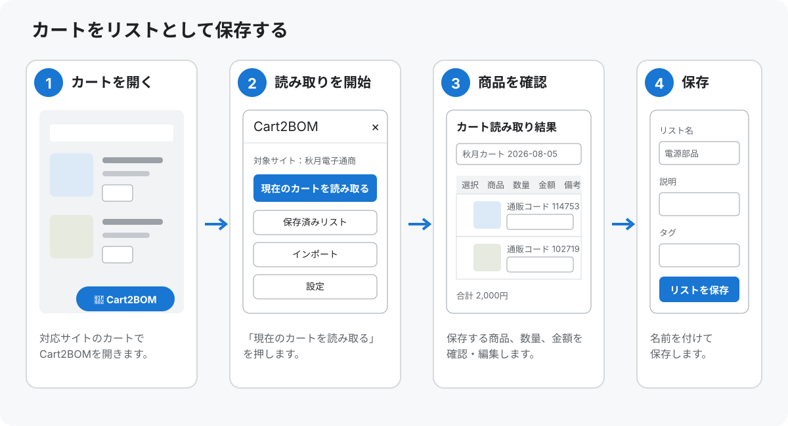
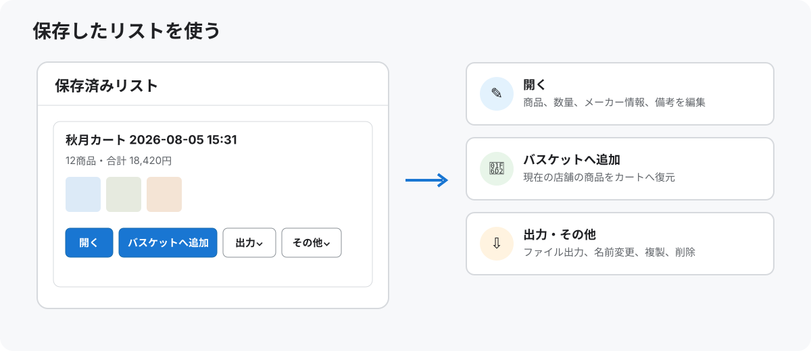

# Cart2BOM

秋月電子通商、モノタロウ、ミスミのカートを、保存・共有・再利用できる部品リストへ変換するUserScriptです。

- カートの商品を画像、通販コード、メーカー、型番、販売単位、数量、価格とともに保存します。
- 保存したリストを編集・複製し、CSV、TSV、JSON、Markdownへ出力できます。
- GitHub Pagesの共有画面で、Cart2BOM未導入の人にも部品リストを見せられます。
- 対応店舗の一括入力機能を利用して、保存した商品をカートへ戻せます。
- 明細の小計から合計金額を算出します。
- リストはブラウザ内に保存され、Cart2BOMから外部サーバーへ送信されません。

Cart2BOMは商品をカートへ追加できますが、注文や見積を確定する操作は行いません。

## 対応サイト

| 店舗 | カートの読み取り | カートへの復元 |
|---|:---:|---|
| [秋月電子通商](https://akizukidenshi.com/) | ○ | ブランケットオーダーを利用 |
| [モノタロウ](https://www.monotaro.com/) | ○ | クイックオーダーへ10商品ずつ自動入力 |
| [ミスミ](https://jp.misumi-ec.com/) | ○ | 「エクセルから一括コピー」を利用 |

ChromeとTampermonkeyの組み合わせで動作を確認しています。スマートフォンには対応していません。

## インストール方法

1. Chromeへ[Tampermonkey](https://www.tampermonkey.net/)をインストールします。
2. [Cart2BOMをインストール](https://raw.githubusercontent.com/masa2429/cart2bom/main/dist/cart2bom.user.js)を開きます。
3. Tampermonkeyの確認画面で「インストール」を押します。
4. 対応サイトを再読み込みし、画面下部に「🛒 Cart2BOM」が表示されることを確認します。

インストール後は、Tampermonkeyの更新確認によって新しいバージョンが配布されます。更新の間隔と自動更新の可否はTampermonkeyの設定に従います。

## カートをリストとして保存する

1. 対応サイトのカートを開きます。
2. 画面下部の「🛒 Cart2BOM」を押します。
3. 「現在のカートを読み取る」を押します。
4. 読み取った商品を確認し、必要に応じて内容を編集します。
5. リスト名を入力して「リストを保存」を押します。



確認画面は「選択・商品・数量・金額・備考・削除」の6列です。メーカー名とメーカー型番は商品欄の詳細を開くと編集できます。見出しのチェックボックスで、保存する商品をまとめて選択・解除できます。

数量を変更すると小計と合計金額が再計算されます。価格を取得できなかった商品は合計に含めず、対象の商品数を表示します。

## 保存したリストを使う

「🛒 Cart2BOM」から「保存済みリスト」を開きます。現在表示している店舗の商品を含むリストだけが表示されます。

- 「開く」：商品内容や数量、備考を確認・編集します。
- 「バスケットへ追加」：現在の店舗の商品をカートへ追加します。
- 「出力」：共有URLや平文をコピーし、CSV、TSV、JSON、Markdownまたは店舗用の一括注文テキストを出力します。
- 「その他」：リストの名前変更、複製、削除を行います。



JSON出力はバックアップや別ブラウザへの移行に利用できます。「インポート」から、Cart2BOMが出力したJSONファイルまたはJSONテキストを読み込めます。

## サークル内で共有する

保存済みリストの「出力」から、用途に応じて次の方法を選べます。

- 「共有URLをコピー」：DiscordやメールでURLを送ります。受け取った人はCart2BOMをインストールしていなくても、[共有画面](https://masa2429.github.io/cart2bom/share/)で商品画像、通販コード・型番、メーカー、数量、価格、備考、店舗別件数、合計金額を確認できます。
- 「平文をコピー」：商品名、通販コード・型番、メーカー、数量、価格、備考、商品URLを、チャットへそのまま貼れる文章としてコピーします。

共有画面では、店舗やチェックボックスで商品を絞り込み、平文のコピー、CSV、TSV、JSON、Markdownの保存、店舗別の一括入力データのコピーができます。Cart2BOMをインストール済みなら「Cart2BOMへ取り込む」からブラウザ内へ保存し、対応店舗のカートへ追加できます。未導入の場合も、各店舗の公式一括入力画面へ移動してコピーしたデータを利用できます。

共有URLはリストを圧縮してURLの`#cart2bom=`以降へ埋め込みます。GitHub Pagesには画面を表示するHTML、CSS、JavaScriptだけを配置し、共有リストをデータベースやファイルとして保存しません。URLのフラグメントは通常のHTTPリクエストにも含まれないため、Cart2BOM用の共有サーバーやアカウントは不要です。URLを開いただけではリストの保存、カートへの追加、注文を行いません。

URLそのものにはリスト名、説明、タグ、商品情報、価格、備考などが含まれます。URLを知っている人は内容を読み取れるため、個人情報や非公開情報を記載せず、公開範囲に注意してください。商品数が多くURLが長くなる場合は、平文またはJSONファイルを利用してください。

## 店舗ごとのカート復元

### 秋月電子通商

ブランケットオーダーの標準フォームへ商品を送り、まとめて買い物かごへ追加します。

### モノタロウ

クイックオーダーへ10商品ずつ送信します。11商品以上の場合は、バスケットとクイックオーダーを自動で往復して最後まで追加します。

### ミスミ

「見積・注文」画面の「エクセルから一括コピー」へ、型番、数量、メーカー名を入力します。列の割り当て、型番照会、カートへの追加までを自動で進めます。

いずれの店舗でも、処理後は注文へ進む前に商品、型番、数量、価格、納期を確認してください。

## 保存されるデータと安全性

- リストと設定は、Tampermonkeyの保存領域を使ってブラウザ内へ保存します。
- Cart2BOM自身には、保存した商品情報を第三者へ送信する機能はありません。
- 共有URLのデータはURLのフラグメントへ格納され、通販サイトのサーバーへ送信されません。URL自体を共有した相手には商品情報が伝わります。
- GitHub Pagesは共有リストを保存せず、アクセス解析や外部APIへの送信も行いません。商品画像だけは、表示時に各通販サイトの公式画像URLから読み込まれます。
- ユーザー名、パスワード、Cookie、セッショントークン、支払い情報は取得・保存しません。
- 商品画像は許可した公式サイトのHTTPS画像だけを、リファラーを送信せず表示します。
- クリップボードへの書き込みとファイルの保存は、対応するボタンを押した場合だけ行います。
- カートへの自動追加は利用者が「バスケットへ追加」を押した場合だけ開始し、注文・見積の確定には進みません。

保存データの安全性は、ブラウザとTampermonkeyの安全性に準じます。

## 免責事項

Cart2BOMが表示する商品情報、価格、在庫、納期は、読み取り時点の通販サイトの表示に基づきます。常に最新かつ正確であることは保証できません。

サイトの画面構成が変更されると、読み取りやカートへの復元が動作しなくなる場合があります。注文を確定する前に、通販サイト上の内容を必ずご自身で確認してください。

## 動作がおかしいとき

1. 対象ページを再読み込みします。
2. TampermonkeyでCart2BOMが有効になっていることを確認します。
3. Cart2BOMのバージョンが最新版か確認します。
4. カート画面を開き直して再実行します。

解決しない場合は、個人情報を除いた画面表示、対象店舗、Cart2BOMのバージョン、再現手順を添えて[Issues](https://github.com/masa2429/cart2bom/issues)へ報告してください。Cookieやログイン情報、住所、注文内容全体は掲載しないでください。

## 開発

Node.js 20以降を用意し、次を実行します。

```sh
npm install
npm test
npm run build:all
```

配布用UserScriptは`dist/cart2bom.user.js`、GitHub Pages用ファイルは`pages-dist`へ生成されます。開発用ソースマップが必要な場合は`npm run build:dev`を使用します。`main`ブランチへのpush時は、テストと両方のビルドに成功した場合だけGitHub Pagesを更新します。

## ライセンス

[MIT License](LICENSE)
