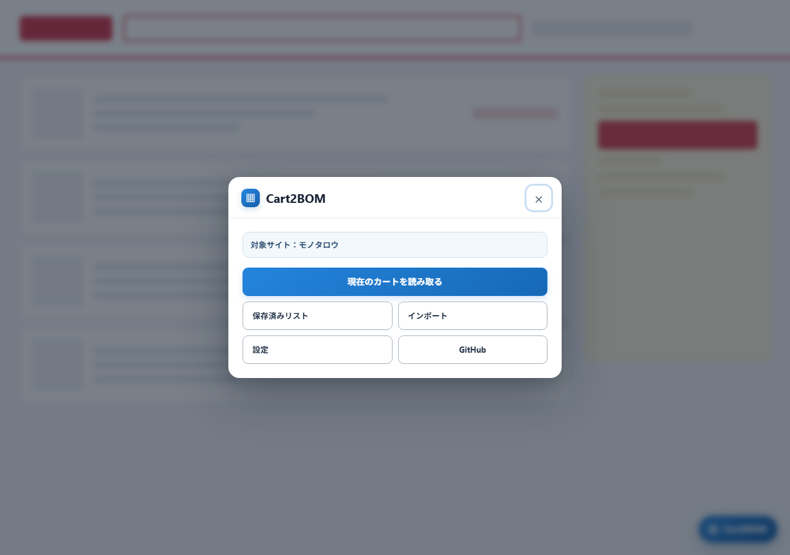
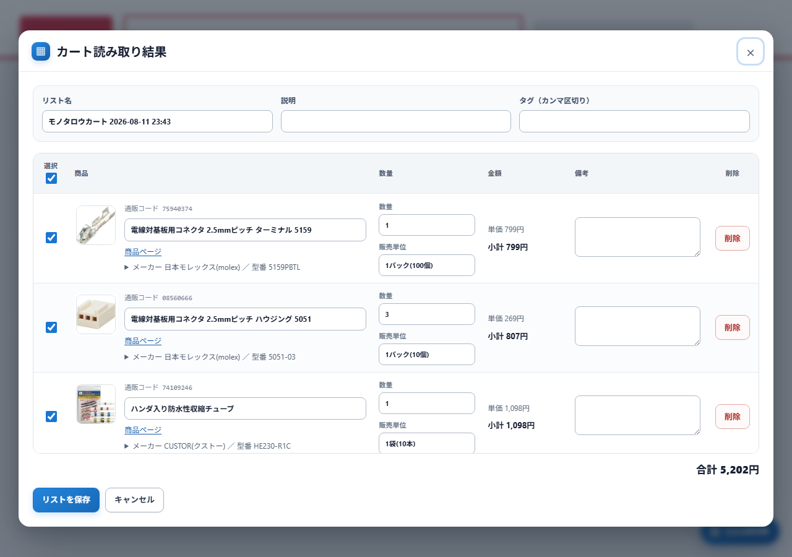
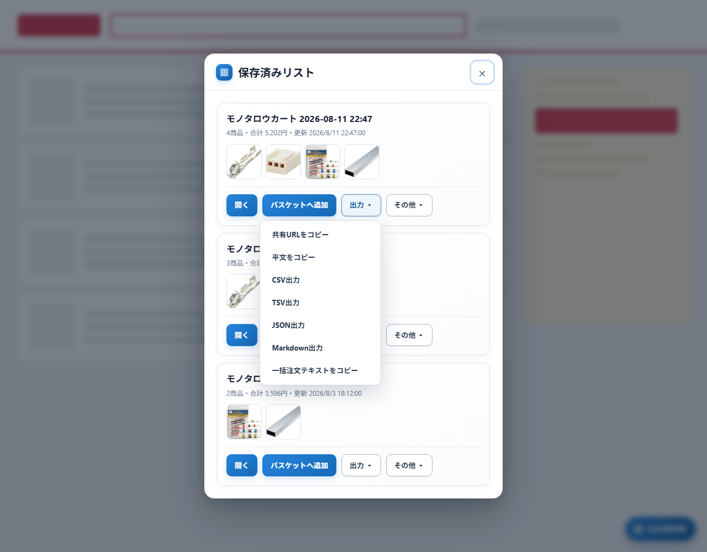

# 部品の発注依頼用ツール Cart2BOM を作った

## 概要

通販サイトのカートを、保存して共有できる部品リストに変換する UserScript である。
秋月電子通商、モノタロウ、ミスミのカートを読み取り、名前を付けて保存し、URL ひとつで他のメンバーへ渡せる。
外部のサーバーを使わず、ブラウザの中だけで動く。

## 背景

部品を選んだ人が発注担当へ渡すとき、いまはチャットにこう貼ることが多い。

```text
電線対基板用コネクタ 2.5mmピッチターミナル 100個入 ×1 https://www.monotaro.com/p/7594/0374/
電線対基板用コネクタ 2.5mmハウジング 3ピン 10個入 ×3
https://www.monotaro.com/p/0856/0666/
はんだ熱収縮チューブ(赤)10本入り ×1
https://www.monotaro.com/p/7410/9246/?t.q=はんだ熱収縮
アルミ角管 10×30×2000 ×1本
https://www.monotaro.com/p/4781/2670/
```

この形式は、部品を選ぶ側と発注する側の双方に追加の作業を強いる。

部品を選ぶ側の作業：

- 商品ページを一つずつ開き、名前と URL を手で写す
- 数量と販売単位の書式が揺れる（「×1」「×3」「×1本」）

発注する側の作業：

- URL を順に開き、カートへ入れ直す
- 「100個入 ×1」が 100 個なのか 1 パックなのかを判断する
- 金額を自分で合計する

## 何ができるか

### 部品を選ぶ側

背景の4点を、そのままモノタロウのカートに入れたとする。
画面右下の「Cart2BOM」ボタンからメニューを開き、「現在のカートを読み取る」を押す。

<!-- 画像は wiki に添付してパスを差し替える -->


確認画面に、商品画像、通販コード、商品名、メーカーと型番、販売単位、数量、単価と小計、合計金額が並ぶ。
名前と URL を写す作業はない。
販売単位は「1パック(100個)」、数量は「1」と別の欄に読み取られるので、「100個入 ×1」のような書き分けも、その解釈も不要になる。
数量はこの画面で直せて、合計も計算し直される。



リスト名を付けて保存する。
渡すときは、保存済みリストの「出力」から「共有URLをコピー」を押して、チャットへ貼る。



### 発注する側

届くのは [このような URL](https://masa2429.github.io/cart2bom/share/#cart2bom=g.H4sIAAAAAAAACqWTXWsTQRSG_8pyrlKYzc7Mfu-lRfBCUWq9CrkoJtSUbBJsNIII6Q7SktCGarGilWAkVkhsoxH6YTQ_5rCb9F_IbAxiL1IlFzuwzJlz3veZd57CY_AYgQJ4gKKFYgeDIYrPGHzEoINigGJL4ZRbKnVUxhTOPcMGAhnwAAiUwUulCeTAS6XALxaK5ZWHRSCXWwEB23QNqtsGEIj229FBNy7pohAYHGNwlvCL-eyTBSBgMtO9c235JhC4ePt9dPImPP4ZNs-jd8PR3icM-ii24yNDhSdN30exJ5uIDSUeN0DRRFFD0VFkIyDAUOxOxiQYpWG1vgCEEdt14w8elMuldU_TKpVKcuogeb_oayVNatakaA3-1K2Vkjl_ZTW7rv5Vfev3j66Vcpqfy2TyWU0WTH2rXKcGoyrlybXSKpDCo3yeQPjjZbTfDjfPx9snQADS5AqM1DEtalnWP2CkJlOp_v8URSO-_FMUfQx6iuxzmeIEok645RKH2jMhSsWalDwHxKnrGCI15oVoG4y63JAQF-_dXb69lJjAQ7GFYiDh3bjOdaouscX4fEOiENXweRuD2sXrr1HvW1Q9DBs7o9MjFBso2nHuXklM41Y9wWh00I1TxqjrTJaZOTMY1aSgeXIWe9JtlTPGqTUvIsN2GLdsKnPW742_1GI23djnJgYfJuGQhk1DPjIMWig6KJrhWX98-GJ09F7uhdW6pMAN15kssyjIkZqcOQeFqWyV64zyK4OSfvYLLRfdAAAFAAA) ひとつである。
開くと、Cart2BOM を入れていなくても、画像付きの一覧と合計金額が表示される。

注文するときは、共有画面の「店舗で注文する」から注文コードと数量をコピーして、公式のクイックオーダーへ貼り付ける。
URL を順に開いてカートへ入れ直す必要はない。
発注する側も Cart2BOM を導入していれば、バスケットへの追加まで自動で進む。
記録に残すなら、共有画面から CSV でも保存できる。

URL ではなく文章で渡したい場合は、「出力」の「平文をコピー」を使う。

```text
モノタロウカート 2026-08-11 22:47

【モノタロウ】
1. 電線対基板用コネクタ 2.5mmピッチ ターミナル 5159
   通販コード・型番: 75940374
   メーカー: 日本モレックス(molex) / メーカー型番: 5159PBTL
   数量: 1 / 販売単位: 1パック(100個)
   単価: 799円 / 小計: 799円
   https://www.monotaro.com/p/7594/0374/
（2〜4件目は省略）

合計 5,202円
```

### もう一度買うとき

モノタロウを開き、保存済みリストの「バスケットへ追加」を押すと、商品はカートへ自動で戻る。

自動で進むのはカートまでで、注文と見積の確定は行わない。
リストは店舗ごとに作る。

## 導入

PC 版 Chrome に [Tampermonkey](https://www.tampermonkey.net/) を入れ、[インストール手順のページ](https://masa2429.github.io/cart2bom/install/) から Cart2BOM を追加する。
対応サイトを開き直すと、画面右下に「Cart2BOM」のボタンが出る。
スマートフォンには対応していない。

## 注意事項

共有 URL は、リストを圧縮して URL 自体に埋め込む仕組みである。
URL を知っている人は誰でも中身を読める。

リストはブラウザの中にだけ保存される。

カートへ戻した後は、注文前に型番、数量、価格、納期を自分で確かめる。
価格や在庫は、読み取った時点から変わっていることがある。

## 参考

- [README](https://github.com/masa2429/cart2bom)（詳しい使い方と免責事項）
- [共有画面](https://masa2429.github.io/cart2bom/share/)
- 動作がおかしいときはページを再読み込みし、直らなければ [Issues](https://github.com/masa2429/cart2bom/issues) へ

<!--
ここから下は、うちの運用に合わせて書き換える。

## うちでの決めごと

- 発注担当：
- 発注の締め切り：
- リスト名の付け方：
- 予算コードとの対応：
-->
